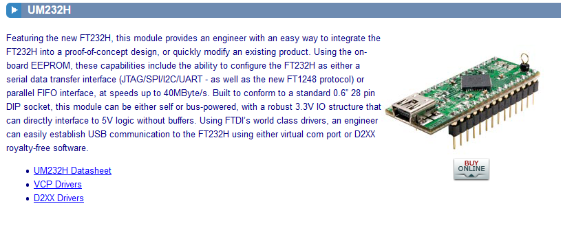
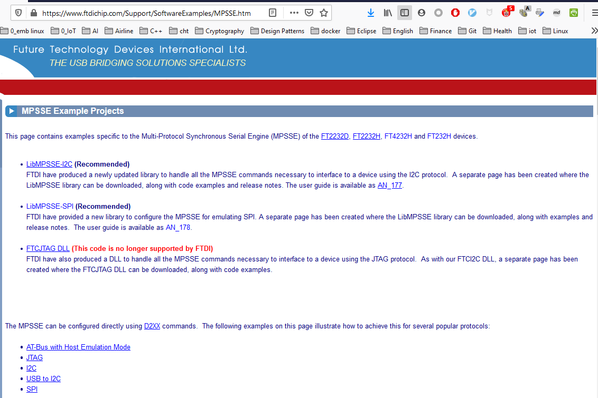
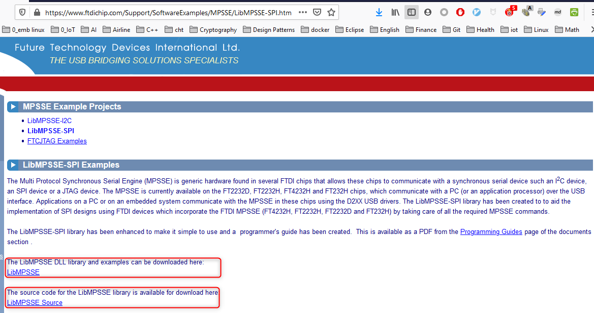

# ftdi_mpsee_spi_serial_flash

This project contains an [LibMPSSE-SPI](https://www.ftdichip.com/Support/SoftwareExamples/MPSSE/LibMPSSE-SPI.htm) example to program [Winbod W25Q64JV](https://www.winbond.com/hq/product/code-storage-flash-memory/serial-nor-flash/index.html?__locale=en&partNo=W25Q64JV) serial flash connected to the SPI channel of [UM232H](https://www.ftdichip.com/Products/Modules/DevelopmentModules.htm#UM232H) module.

One copy of data sheet of `W25Q64JV` is placed at [docs](docs) folder.


## FTDI UM232H

* [UM232H](https://www.ftdichip.com/Products/Modules/DevelopmentModules.htm#UM232H)

  

* https://www.ftdichip.com/Support/SoftwareExamples/MPSSE.htm

  

* https://www.ftdichip.com/Support/SoftwareExamples/MPSSE/LibMPSSE-SPI.htm

  


## Building the example

* Configure the build using cmake

   ```text
   C:\dev\ftdi_mpsse_spi_serial_flash>mkdir cmake-build-mingw32
   C:\dev\ftdi_mpsse_spi_serial_flash>cd cmake-build-mingw32
   C:\dev\ftdi_mpsse_spi_serial_flash\cmake-build-mingw32>cmake .. -DCMAKE_BUILD_TYPE=Debug -G "CodeBlocks - MinGW Makefiles"
   -- The C compiler identification is GNU 10.1.0
   -- The CXX compiler identification is GNU 10.1.0
   -- Check for working C compiler: C:/msys64/mingw32/bin/gcc.exe
   -- Check for working C compiler: C:/msys64/mingw32/bin/gcc.exe -- works
   -- Detecting C compiler ABI info
   -- Detecting C compiler ABI info - done
   -- Detecting C compile features
   -- Detecting C compile features - done
   -- Check for working CXX compiler: C:/msys64/mingw32/bin/g++.exe
   -- Check for working CXX compiler: C:/msys64/mingw32/bin/g++.exe -- works
   -- Detecting CXX compiler ABI info
   -- Detecting CXX compiler ABI info - done
   -- Detecting CXX compile features
   -- Detecting CXX compile features - done
   Found MPSSE library - C:/dev/ftdi_mpsse_spi_serial_flash/src/mpsse/mingw-x86/libMPSSE.a
   -- Configuring done
   -- Generating done
   -- Build files have been written to: C:/dev/ftdi_mpsse_spi_serial_flash/cmake-build-debug-mingw32
   ```


* Build the application

  ```text
  C:\dev\ftdi_mpsse_spi_serial_flash\cmake-build-mingw32>cmake --build . --target all -v
  ```

## Example of output

```Text
C:\dev\ftdi_mpsse_spi_serial_flash\cmake-build-debug-mingw32>ftdi_mpsse_spi_serial_flash.exe
Number of SPI channels: 1

# read ID:
ef 40 17

# read page at address 0x000000:
read data:
00 01 02 03 04 05 06 07 - 08 09 0a 0b 0c 0d 0e 0f
10 11 12 13 14 15 16 17 - 18 19 1a 1b 1c 1d 1e 1f
20 21 22 23 24 25 26 27 - 28 29 2a 2b 2c 2d 2e 2f
30 31 32 33 34 35 36 37 - 38 39 3a 3b 3c 3d 3e 3f
40 41 42 43 44 45 46 47 - 48 49 4a 4b 4c 4d 4e 4f
50 51 52 53 54 55 56 57 - 58 59 5a 5b 5c 5d 5e 5f
60 61 62 63 64 65 66 67 - 68 69 6a 6b 6c 6d 6e 6f
70 71 72 73 74 75 76 77 - 78 79 7a 7b 7c 7d 7e 7f
80 81 82 83 84 85 86 87 - 88 89 8a 8b 8c 8d 8e 8f
90 91 92 93 94 95 96 97 - 98 99 9a 9b 9c 9d 9e 9f
a0 a1 a2 a3 a4 a5 a6 a7 - a8 a9 aa ab ac ad ae af
b0 b1 b2 b3 b4 b5 b6 b7 - b8 b9 ba bb bc bd be bf
c0 c1 c2 c3 c4 c5 c6 c7 - c8 c9 ca cb cc cd ce cf
d0 d1 d2 d3 d4 d5 d6 d7 - d8 d9 da db dc dd de df
e0 e1 e2 e3 e4 e5 e6 e7 - e8 e9 ea eb ec ed ee ef
f0 f1 f2 f3 f4 f5 f6 f7 - f8 f9 fa fb fc fd fe ff


# read status:
00

# enable write

# read status:
02

# erase sector at address 0x000000:

# read status:
03

# read status:
03

# read status:
03

# read status:
00

# read page at address 0x000000:
read data:
ff ff ff ff ff ff ff ff - ff ff ff ff ff ff ff ff
ff ff ff ff ff ff ff ff - ff ff ff ff ff ff ff ff
ff ff ff ff ff ff ff ff - ff ff ff ff ff ff ff ff
ff ff ff ff ff ff ff ff - ff ff ff ff ff ff ff ff
ff ff ff ff ff ff ff ff - ff ff ff ff ff ff ff ff
ff ff ff ff ff ff ff ff - ff ff ff ff ff ff ff ff
ff ff ff ff ff ff ff ff - ff ff ff ff ff ff ff ff
ff ff ff ff ff ff ff ff - ff ff ff ff ff ff ff ff
ff ff ff ff ff ff ff ff - ff ff ff ff ff ff ff ff
ff ff ff ff ff ff ff ff - ff ff ff ff ff ff ff ff
ff ff ff ff ff ff ff ff - ff ff ff ff ff ff ff ff
ff ff ff ff ff ff ff ff - ff ff ff ff ff ff ff ff
ff ff ff ff ff ff ff ff - ff ff ff ff ff ff ff ff
ff ff ff ff ff ff ff ff - ff ff ff ff ff ff ff ff
ff ff ff ff ff ff ff ff - ff ff ff ff ff ff ff ff
ff ff ff ff ff ff ff ff - ff ff ff ff ff ff ff ff


# enable write

# write page at address 0x000000:
data to write:
00 01 02 03 04 05 06 07 - 08 09 0a 0b 0c 0d 0e 0f
10 11 12 13 14 15 16 17 - 18 19 1a 1b 1c 1d 1e 1f
20 21 22 23 24 25 26 27 - 28 29 2a 2b 2c 2d 2e 2f
30 31 32 33 34 35 36 37 - 38 39 3a 3b 3c 3d 3e 3f
40 41 42 43 44 45 46 47 - 48 49 4a 4b 4c 4d 4e 4f
50 51 52 53 54 55 56 57 - 58 59 5a 5b 5c 5d 5e 5f
60 61 62 63 64 65 66 67 - 68 69 6a 6b 6c 6d 6e 6f
70 71 72 73 74 75 76 77 - 78 79 7a 7b 7c 7d 7e 7f
80 81 82 83 84 85 86 87 - 88 89 8a 8b 8c 8d 8e 8f
90 91 92 93 94 95 96 97 - 98 99 9a 9b 9c 9d 9e 9f
a0 a1 a2 a3 a4 a5 a6 a7 - a8 a9 aa ab ac ad ae af
b0 b1 b2 b3 b4 b5 b6 b7 - b8 b9 ba bb bc bd be bf
c0 c1 c2 c3 c4 c5 c6 c7 - c8 c9 ca cb cc cd ce cf
d0 d1 d2 d3 d4 d5 d6 d7 - d8 d9 da db dc dd de df
e0 e1 e2 e3 e4 e5 e6 e7 - e8 e9 ea eb ec ed ee ef
f0 f1 f2 f3 f4 f5 f6 f7 - f8 f9 fa fb fc fd fe ff


# read status:
00

# read page at address 0x000000:
read data:
00 01 02 03 04 05 06 07 - 08 09 0a 0b 0c 0d 0e 0f
10 11 12 13 14 15 16 17 - 18 19 1a 1b 1c 1d 1e 1f
20 21 22 23 24 25 26 27 - 28 29 2a 2b 2c 2d 2e 2f
30 31 32 33 34 35 36 37 - 38 39 3a 3b 3c 3d 3e 3f
40 41 42 43 44 45 46 47 - 48 49 4a 4b 4c 4d 4e 4f
50 51 52 53 54 55 56 57 - 58 59 5a 5b 5c 5d 5e 5f
60 61 62 63 64 65 66 67 - 68 69 6a 6b 6c 6d 6e 6f
70 71 72 73 74 75 76 77 - 78 79 7a 7b 7c 7d 7e 7f
80 81 82 83 84 85 86 87 - 88 89 8a 8b 8c 8d 8e 8f
90 91 92 93 94 95 96 97 - 98 99 9a 9b 9c 9d 9e 9f
a0 a1 a2 a3 a4 a5 a6 a7 - a8 a9 aa ab ac ad ae af
b0 b1 b2 b3 b4 b5 b6 b7 - b8 b9 ba bb bc bd be bf
c0 c1 c2 c3 c4 c5 c6 c7 - c8 c9 ca cb cc cd ce cf
d0 d1 d2 d3 d4 d5 d6 d7 - d8 d9 da db dc dd de df
e0 e1 e2 e3 e4 e5 e6 e7 - e8 e9 ea eb ec ed ee ef
f0 f1 f2 f3 f4 f5 f6 f7 - f8 f9 fa fb fc fd fe ff

```